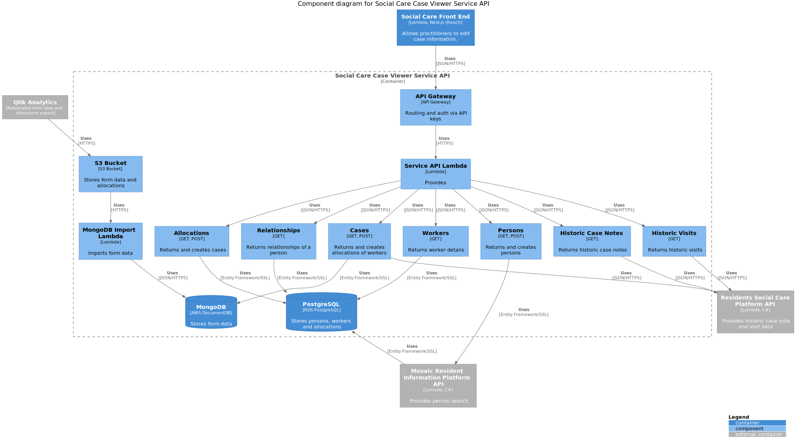

[](https://circleci.com/gh/LBHackney-IT/social-care-case-viewer-api)

# Social Care Case Viewer API

The Social Care Service API provides [service API](http://playbook.hackney.gov.uk/API-Playbook/platform_api_vs_service_api#a-service-apis) capabilities for the [Social Care Frontend](https://github.com/LBHackney-IT/lbh-social-care) which is part of the Social Care system (see [Social Care System Architecture](https://github.com/LBHackney-IT/social-care-architecture/tree/main) for more details).



## Table of contents

  - [Getting started](#getting-started)
    - [Prerequisites](#prerequisites)
    - [Dockerised dependencies](#dockerised-dependencies)
    - [Installation](#installation)
  - [Usage](#usage)
    - [Running the application](#running-the-application)
      - [Using dotnet run](#using-dotnet-run)
      - [Using docker](#using-docker)
    - [Running the tests](#running-the-tests)
      - [Using the terminal](#using-the-terminal)
      - [Using an IDE](#using-an-ide)
  - [Documentation](#documentation)
    - [Architecture](#architecture)
    - [API design](#api-design)
    - [Databases](#databases)
      - [MongoDB (DocumentDB in AWS)](#mongodb-documentdb-in-aws)
      - [PostgreSQL (RDS PostgreSQL in AWS)](#postgresql-rds-postgresql-in-aws)
      - [Connecting to a database](#connecting-to-a-database)
      - [Updating the database schema](#updating-the-database-schema)
      - [Making manual updates](#making-manual-updates)
    - [Deployment](#deployment)
    - [Infrastructure](#infrastructure)
    - [Related repositories](#related-repositories)
  - [Active contributors](#active-contributors)
  - [License](#license)

## Getting started

### Prerequisites

- [Docker](https://www.docker.com/products/docker-desktop)
- [.NET Core 3.1](https://dotnet.microsoft.com/download)

### Dockerised dependencies

- PostgreSQL 12
- MongoDB

### Installation

1. Clone this repository

```sh
$ git clone git@github.com:LBHackney-IT/social-care-case-viewer-api.git
```

## Usage

### Running the application

There are two ways of running the application: using dotnet or using docker.

#### Using dotnet run
Using the dotnet command will not automatically connect the API to any local database instances.

To serve the API locally with dotnet,
run `dotnet run` from within the [SocialCareCaseViewerApi](./SocialCareCaseViewerApi) project directory, i.e:

```sh
$ cd SocialCareCaseViewerApi && dotnet run
```

**The application will be served at http://localhost:5000**.

#### Using docker

Run the API locally with connected local dev databases using this command:

```sh
$ make serve
```
**The application will be served at http://localhost:3000**.

N.B: This would only spin up the Application, Postgres & MongoDB locally in docker.
It doesn't include setup for spinning up other APIs that this service connects to in Staging or in Production.


### Running the tests

There are two ways of running the tests: using the terminal and using an IDE.

#### Using the terminal

To run all tests, use:

```sh
$ make test
```

To run some tests i.e. single or a group, run the test databases in the background:

```sh
$ make start-test-dbs
```

And then you can filter through tests, using the `--filter` argument of the
`dotnet test` command:

```sh
# E.g. for a specific test, use the test method name
$ dotnet test --filter GivenHttpClientReturnsValidResponseThenGatewayReturnsListCaseNotesResponse
# E.g. for a file, use the test class name
$ dotnet test --filter SocialCarePlatformAPIGatewayTests
```

If your docker test database is out of sync with the schema on your current branch run

```sh
$ make restart-db
```

See [Microsoft's documentation on running selective unit tests](https://docs.microsoft.com/en-us/dotnet/core/testing/selective-unit-tests?pivots=mstest) for more information.

#### Using an IDE

Run the test databases in the background, using:

```sh
$ make start-test-dbs
```

This will allow you to run the tests as normal in your IDE.

## Documentation

### Architecture

As this service API is a part of the Social Care System, higher level documentation lives in a separate repository called [Social Care System Architecture](https://github.com/LBHackney-IT/social-care-architecture/).

To find out more about the process and tooling for our diagrams, see [Process documentation in Social Care System Architecture](https://github.com/LBHackney-IT/social-care-architecture/blob/main/process.md).

### API design

We use [SwaggerHub](https://swagger.io/tools/swaggerhub/) to document the API design, of which we have two versions:

- [Hosted by SwaggerHub](https://app.swaggerhub.com/apis-docs/Hackney/social-care-case-viewer-api/1.0.0) - for designing endpoints as a contract before we create a new feature
- [Self-hosted](https://dr03nduqxh.execute-api.eu-west-2.amazonaws.com/staging/swagger/index.html) - for actual endpoint design which is auto-generated using comments

### Databases

The service API has two databases (as seen in the [C4 component diagram](./docs/component-diagram.svg)):

#### [MongoDB](https://www.mongodb.com) (DocumentDB in AWS)

This database stores:

1. Case history. An audit log of each time an event recorded against a person.
2. Google Form submission meta data. E.g: Form name, who created it, timestamp.
3. Full data of forms submitted using the new system.

#### [PostgreSQL](https://www.postgresql.org) (RDS PostgreSQL in AWS)

This database stores:

1. Stores person data. E.g: Addresses, telephone number, worker allocations.

#### Connecting to a database

Sometimes we need to directly connect to a database for an environment to diagnose
an issue or because we need to [make a manual update](#making-manual-updates).
This is possible to do via the AWS console, see [Connecting to a database](docs/connecting-to-a-database.md) documentation.

#### Updating the database schema

We currently don't have database migrations set up for the databases which means changes to the schema are documented in the repository and done manually via the AWS console.

If you need to make changes e.g. add a new table to the PostgreSQL database, then see [Updating the database schema](./docs/updating-database-schema.md) for how we manage this and do this via the AWS console.

#### Making manual updates

From time to time, we are required to make manual data updates because it's something that's not possible through the UI of the Social Care System. However, this is something we only want to do when really necessary as it requires directly connecting to the database and running SQL statements.

To keep track of these changes, we document them in `/database/manual-updates`. If you need to make a manual data update, then:

1. Duplicate [our template file](database/manual-updates/yyyy-mm-dd_1-<title>-template.md)
2. Rename the duplicated file by replacing the date and the title
3. Fill in the sections of the file
4. Commit, push and create a PR

### Deployment

We have two environments:

- Staging (StagingAPIs AWS account)
- Production (Mosaic-Production AWS account)

and two deployment branches:

- `master` which deploys to Staging and Production
- `development` which deploys to Staging

This means pull request merges into `master` and `development` both trigger a deployment to Staging, but only `master` can trigger a deployment for Production.

To deploy to Production, we first ensure that changes are verified in Staging and then we merge `development` into `master`.

We use CircleCI to handle deployment, see [CircleCI config](./.circleci/config.yml).

### Infrastructure

For deploying the Lambdas and related resources, we used the [Serverless framework](https://www.serverless.com) (see [serverless.yml](./serverless.yml)).

For managing the database in Staging, we use [Terraform](https://www.terraform.io) that is defined within `/terraform/staging` in this repository.

For managing the database and other resources in Production, we use Terraform that is defined within the [Infrastructure repository](https://github.com/LBHackney-IT/infrastructure/blob/master/projects/mosaic).

### Related repositories

| Name | Purpose |
|-|-|
| [LBH Social Care Frontend](https://github.com/LBHackney-IT/lbh-social-care-frontend) | Provides the UI/UX of the Social Care System. |
| [Residents Social Care Platform API](https://github.com/LBHackney-IT/residents-social-care-platform-api) | Provides [platform API](http://playbook.hackney.gov.uk/API-Playbook/platform_api_vs_service_api#b-platform-apis) capabilities by providing historic social care data from Mosaic to the Social Care System. |
| [Mosaic Resident Information API](https://github.com/LBHackney-IT/mosaic-resident-information-api) | Provides [platform API](http://playbook.hackney.gov.uk/API-Playbook/platform_api_vs_service_api#b-platform-apis) capabilities by providing information about residents from Mosaic to the Social Care System. |
| [Infrastructure](https://github.com/LBHackney-IT/infrastructure) | Provides a single place for AWS infrastructure defined using [Terraform](https://www.terraform.io) as [infrastructure as code](https://en.wikipedia.org/wiki/Infrastructure_as_code) as part of Hackney's new AWS account strategy. NB: Due to its recent introduction, the Social Care System has infrastructure across multiple places. |
| [API Playbook](http://playbook.hackney.gov.uk/API-Playbook/) | Provides guidance to the standards of APIs within Hackney. |

## Active contributors

- **Tuomo Karki**, Lead Developer at Hackney (tuomo.karki@hackney.gov.uk)
- **Ben Reynolds-Carr**, Junior Developer at Hackney (ben.reynolds-carr@hackney.gov.uk)
- **Jerome Wanliss**, Intern Software Engineer at Hackney (jerome.wanliss@hackney.gov.uk)
- **John Farrell**, Senior Software Engineer at Made Tech (john.farrell@hackney.gov.uk)
- **Renny Fadoju**, Software Engineer at Made Tech (renny.fadoju@hackney.gov.uk)
- **Neil Kidd**, Lead Software Engineer at Made Tech (neil.kidd@hackney.gov.uk)
- **Wen Ting Wang**, Software Engineer at Made Tech (wenting.wang@hackney.gov.uk)

## License

[MIT License](LICENSE)
