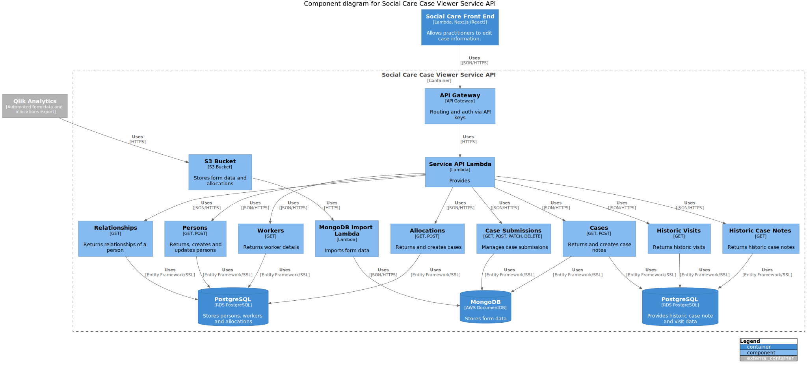

# Social Care Case Viewer API

The Social Care Service API provides the backend service for the [Social Care Front end](https://github.com/LBHackney-IT/lbh-social-care)

It is a part of the Social Care system (see [Social Care System Architecture](https://github.com/LBHackney-IT/social-care-architecture/tree/main) for more details).

- [Social Care Case Viewer API](#social-care-case-viewer-api)
  - [Documentation](#documentation)
    - [C4 Component Diagram](#c4-component-diagram)
    - [Swagger API](#swagger-api)
  - [Getting started](#getting-started)
    - [Prerequisites](#prerequisites)
    - [Dockerised dependencies](#dockerised-dependencies)
    - [Installation](#installation)
  - [Contributing](#contributing)
  - [Usage](#usage)
    - [Running the application](#running-the-application)
    - [Running the tests](#running-the-tests)
  - [Active Contributors](#active-contributors)
  - [License](#license)

## Documentation

Higher level Architecture diagrams can be found in the  [Social Care System Architecture](https://github.com/LBHackney-IT/social-care-architecture/) repository.

### C4 Component Diagram



### Swagger API

- [Staging Environment](https://dr03nduqxh.execute-api.eu-west-2.amazonaws.com/staging/swagger/index.html)

## Getting started

### Prerequisites

- [Docker](https://www.docker.com/products/docker-desktop)
- [.NET Core 3.1](https://dotnet.microsoft.com/download)

### Dockerised dependencies

- PostgreSQL 12
- MongoDB

### Installation

1. Clone this repository

```sh
$ git clone git@github.com:LBHackney-IT/social-care-case-viewer-api.git
```

## Contributing

- `master` branch is responsible for the code running in production
- Changes to the codebase are first merged into the `development` branch to be verified for correctness in staging
- `development` branch is responsible for staging. When code is merged to the `staging` branch, the staging environment is automatically rebuilt and deployed.
- When changes are verified in staging, changes can be merged into `master`

## Usage

### Running the application

To serve the API locally, use:

```sh
$ cd SocialCareCaseViewerApi && dotnet run
```

The application will be served at http://localhost:5000.

### Running the tests

To run all tests and keep the test database running:

```sh
$ docker-compose up
```

## Active Contributors

- **Tuomo Karki**, Lead Developer at Hackney (tuomo.karki@hackney.gov.uk)
- **Ben Reynolds-Carr**, Junior Developer at Hackney (ben.reynolds-carr@hackney.gov.uk)
- **Jerome Wanliss**, Intern Software Engineer at Hackney (jerome.wanliss@hackney.gov.uk)
- **John Farrell**, Senior Software Engineer at Made Tech (john.farrell@hackney.gov.uk)
- **Renny Fadoju**, Software Engineer at Made Tech (renny.fadoju@hackney.gov.uk)
- **Neil Kidd**, Lead Software Engineer at Made Tech (neil.kidd@hackney.gov.uk)
- **Wen Ting Wang**, Software Engineer at Made Tech (wenting.wang@hackney.gov.uk)

## License

[MIT License](LICENSE)
