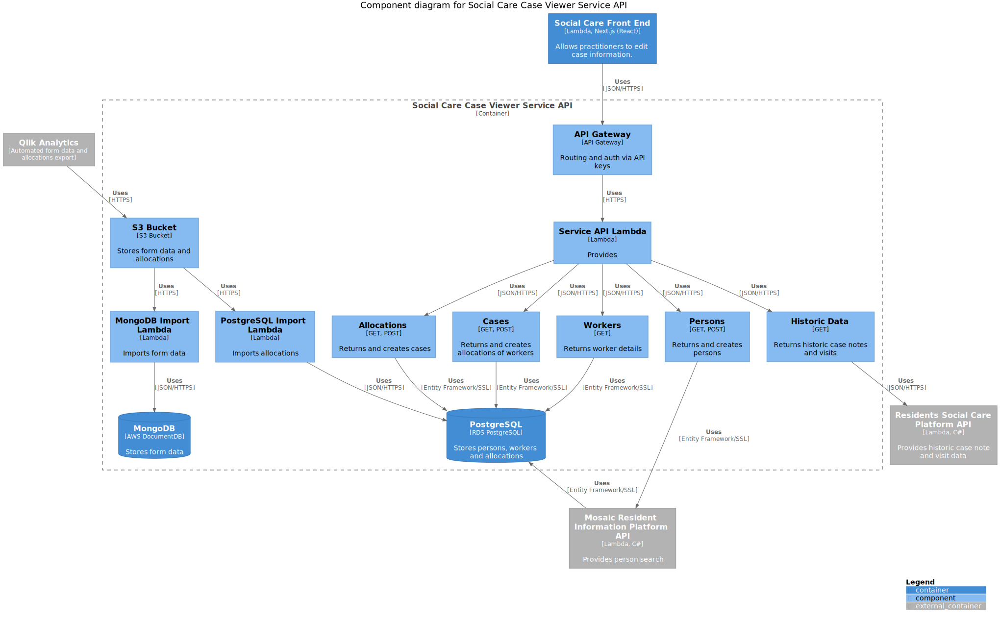

# Diagrams Test File

## Component Diagram as exported png

The issue is that PlantUML server truncates large diagrams. See the [PlantUML faq](https://plantuml.com/faq)

## Component Diagram as exported svg

